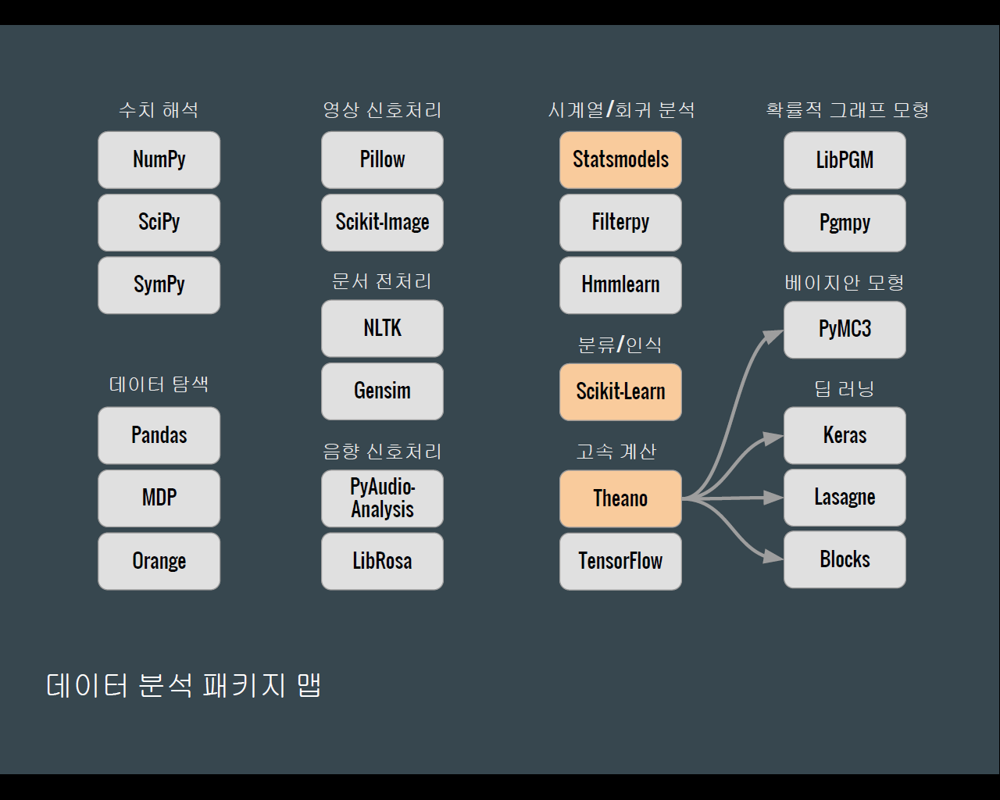

# 삼성멀티캠퍼스 빅데이터를 활용한 파이썬 프로그래밍

강사 : 김일한 (ilhank@naver.com)  
자료 : 70.12.110.160 ( ID : python )

앞으로 1주일 동안 다음과 같은 3가지 라이브러리에 대해서 공부하도록 한다.
- pandas
- beautifulsoup
- matplotlib

설치는 다음과 같은 명령어로 진행한다.
```
pip install pandas beautifulsoup matplotlib
```

---

## 시작하기에 앞서

파이썬 데이터분석 라이브러리는 다음과 같은 로드맵 한장으로 정리할 수 있다. 



`Numpy,Pandas,Scikit-Learn,Tensorflow,Keras` 등을 공부하는게 좋다. 이 중에서도 `Pandas`는 기본이 되므로 먼저 하자. 

---

## Pandas 라이브러리

이 과정에서 우리는 `Jupyter Notebook`을 주로 사용할 예정이다. `Anaconda`를 설치하면 실행이 가능하다. 터미널 창에 아래와 같은 명령어를 치도록 하자.

```
jupyter notebook
```

기본 브라우저로 `Chrome` 브라우저가 뜨면 성공이다.

### 1. Jupyter Notebook의 기본

---

### 2. 